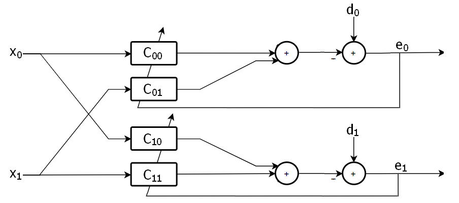
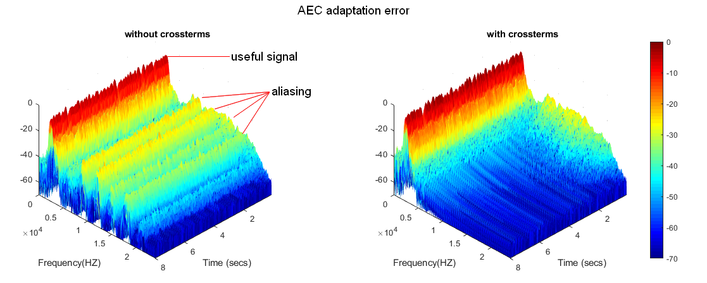

# SubbandAdaptiveX
### Subband Adaptive System with Crossterms for aliasing reduction

These scripts and functions was developed for the course *Circuiti e Algoritmi per Applicazioni Mutimediali* at Università Politecnica delle Marche, following the article *Adaptive filtering in subbands with critical sampling: analysis, experiments, and application to acoustic echo cancellation - A.Gilloire, M.Vetterli*

  

* `N_LMS.m` simple LMS and NLMS single channel adaptive filter

* `QMF_2.m` Quadrature Mirror Filter bank for analysis/synthesis, made with Johnston 12B coefficients

* `QMF_poly.m` Quadrature Mirror Filter bank for analysis/synthesis, made with Johnston 12B coefficients and polyphase decomposition

* `pQMF.m` Multi-band pseudo QMF filter bank for analysis/synthesis, made with cosine modulation of a prototype LP filter

* `Adaptive_QMFB_2.m` Adaptive 2-band structure with QMF

* `Adaptive_QMFB_2_cross.m` Adaptive 2-band structure with QMF and cross-filters

* `Adaptive_pQMFB.m` Adaptive multiband structure with pseudoQMF and cross-filters

* `qmfa.m` , `qmfs.m` analysis/synthesis functions

* `nlms_cross_dual.m` , `nlms_cross_multi.m` adaptive functions

* `Adaptive_AEC.m` Adaptive Acoustic Echo Cancellation application scenario of multirate system with crossterms

  

